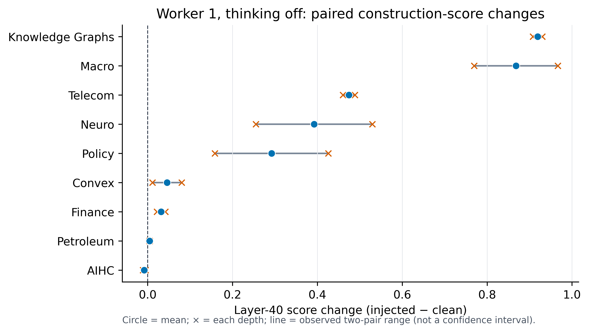

# Cross-domain construction-signal robustness

This is a sensitivity analysis of the saved Scenario 1 activations. It made **no new model calls** and did not redesign or rerun Scenario 1.

## What the headline means

Worker 1, thinking off, layer 40 reaches **0.889 mean held-out-domain AUROC** for the `injection_present` construction label. The pooled AUROC is 0.710. This detects the presence of injected prompt construction/tokens; it is not compromise detection. All 36 injected runs resisted, so compromise-detection AUROC cannot be estimated from this sample.

AIHC is the only 0.0 held-out fold; the other eight folds are 1.0. With four observations in each domain fold, those estimates are coarse and fragile.

## Style and exposure sensitivity

Six domains use plain text; Macro alone wraps text in `<think>`; KG and Convex use chat special tokens plus explicit tool syntax. Seven domains use natural carrier selection. Policy and Telecom require a clean anchor and were position-adjusted.

| Cohort | Domains | Fold filtering only | Full training/evaluation re-fit |
|---|---:|---:|---:|
| All domains | 9 | 0.889 | 0.889 |
| Remove KG + Convex (Macro remains) | 7 | 0.857 | 0.786 |
| Exact plain-text subset | 6 | 0.833 | 0.750 |

The fold-filtered column preserves probes trained with all nine domains. The re-fit column removes excluded domains from both training and evaluation; it is the stricter ablation.

## Requested robustness checks

- Train-fold-only domain-mean residualization changes Goldowsky-Dill mean fold AUROC from 0.889 to 0.833. Held-out values never fit the transform.
- The end-to-end balanced within-domain permutation null re-fits every probe. Its add-one p-value for mean fold AUROC is 0.0030 across 999 deterministic permutations.
- The paired-delta forest plot shows both depth-specific points and their mean. Each domain has only two pairs, so the plotted range is not a confidence interval.

## Interpretation boundary

These checks show that the construction signal persists but changes when attack style and domain baselines are altered. Worker 2 and executor estimates are also based on only nine held-out domains and small per-mode sample counts. A new combined natural-text attack, mechanism axis, or arbitrary tool target would require a future Scenario 1 redesign by the research group; it is not part of this cleanup.
